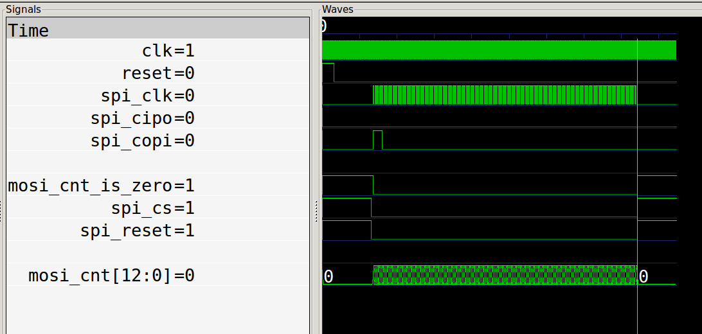

# fixed with #511

Dave Shah identified and fixed this nextpnr bug within minutes of reporting. https://github.com/YosysHQ/nextpnr/pull/511

# spi reset issues

Problem is that the async reset (from spi chip select) isn't always working to reset mosi_cnt[12:0] to 0.

from [spi_perihperal](spi_peripheral.v)

    assign spi_reset = reset | spi_cs;  // combined reset

    ...

    assign mosi_cnt_is_zero = mosi_cnt == 0;

    always @(posedge spi_clk or posedge spi_reset)
        if (spi_reset)
        begin
            mosi_cnt <= 'b0;    // <- this doesn't always happen
            mosi_shift <= 'b0;
            eoa <= 'b0;
            re <= 'b0;
            rd <= 'b0;
            eot <= 'b0;
        end else begin

# Simulates correctly

* cs goes high, causing spi_reset:
    * mosi_cnt set to 0
    * mosi_cnt_is_zero goes high

Run make gtkwave to show the vcd. vcd is generated with cocotb and an external python module not included here.

# In the hardware scope

Design is built with [makefile](Makefile), targets ecp5 12k, top is [top.v](top.v).
A python program uses spidev to make a transfer.

yellow is clock, cyan is cs, purple is data

Then in [top.v](top.v) these 3 assignments bring out some internal signals for the scope:

    assign pmod6[0] = mosi_cnt_is_zero;     // digital 7
    assign pmod6[1] = spi_cs;               // digital 6
    assign pmod6[2] = spi_reset;            // digital 5

This pic shows a correct start with mosi_cnt_is_zero being high and then going low as data starts getting received.
However after spi_cs rises at the end of the packet, the spi_reset goes high (digital 5) but mosi_cnt  doesn't get reset to 0 (digital 7).

Then the next packet is not received, because mosi_cnt doesn't start at 0, but this time as cs goes high, mosi_cnt does get to 0.

# Yosys show

after ecp5_synth design is shown with yosys show

Here spi_peripheral.spi_reset is resetting the mosi_cnt register.

spi_peripheral.spi_reset is brought out and assigned to digital 5 on the scope pics.

